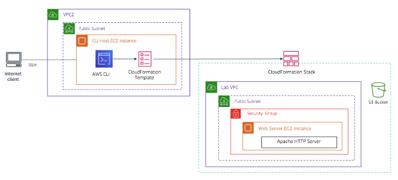

# Troubleshoot the deployment of an AWS CloudFormation stack by using the AWS CLI

Click on following link to preview:

https://htmlpreview.github.io/?https://github.com/sameerkhule1/AWS_ProjectsAndLabs/blob/main/Automation%20with%20CloudFormation/Troubleshoot%20the%20deployment%20of%20an%20AWS%20CloudFormation%20stack%20by%20using%20the%20AWS%20CLI/Workbench_files/README.html

